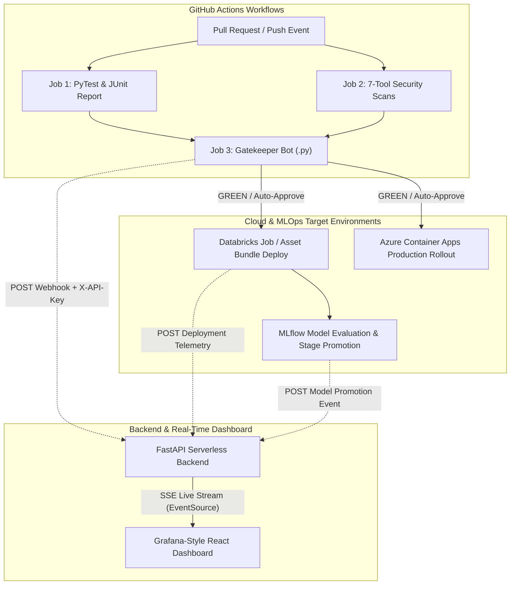

# 🚦 Traffic Light Governance: Enterprise MLOps & CI/CD Observability Platform

        

An end-to-end, real-time **MLOps & DevOps Governance Platform** designed to monitor CI/CD pipelines, enforce automated Pull Request quality gates, orchestrate Databricks jobs, govern MLflow model stage transitions, and visualize telemetry via a rich Grafana-inspired React dashboard with live Server-Sent Events (SSE) streaming.

---

## 📌 Executive Summary & Architecture

In modern AI/ML engineering, reviewing every Pull Request or model promotion manually creates bottleneck overhead, while unrestricted auto-merging introduces security vulnerabilities and production regressions.

**Traffic Light Governance** solves this by establishing a unified observability and policy enforcement engine across three core pillars:
1. **Automated Risk Matrix (Gatekeeper Bot)**: Analyzes code diffs, unit tests (`pytest`), and 7 specialized open-source security engines (`Semgrep`, `Bandit`, `Snyk`, `Safety`, `pip-audit`, `Trivy`, `Gitleaks`).
2. **Real-Time Telemetry Backend (`backend/`)**: Serverless FastAPI application backed by dual SQLite/Turso persistence and SSE live streams (`/api/v1/metrics/events/stream`).
3. **Grafana-Inspired UI Dashboard (`dashboard/`)**: Dark glassmorphism React + Vite application featuring interactive Recharts visualization, DORA metrics, multi-tool security radar, and live activity feeds.



---

## 🚦 The Traffic Light Governance Matrix

| Status | Color Badge | Trigger Conditions | Automated Action & Enforcement |
| :--- | :--- | :--- | :--- |
| **Auto-Approve** | 🟢 **GREEN** | Configuration/Doc changes (`.yaml`, `.json`, `.md`) + 100% Tests Pass + Zero Security Findings | **Ready for Auto-Merge & Azure/Databricks Rollout** |
| **Review Required** | 🟡 **YELLOW** | Core Logic (`.py`, `.js`) changes OR Medium/Low Security Findings (`<5`) + Tests Pass | **Manual Peer Review & Sign-off Required** |
| **Merge Blocked** | 🔴 **RED** | Major Infra (`Dockerfile`, `requirements.txt`) OR Any Test Failure OR Critical/High Security Findings | **Merge Blocked & Pipeline Halted (`exit 1`)** |

---

## 🛡️ Multi-Tool Security Suite (7 Integrated Engines)

Our CI/CD pipelines run a parallel matrix of open-source and enterprise-ready security tools to provide 360° coverage across application code, third-party dependencies, secrets, and container images:

1. **Semgrep**: Fast Static Application Security Testing (SAST) analyzing Python and JavaScript syntax trees against curated security rules.
2. **Bandit**: Python AST vulnerability scanner hunting for hardcoded passwords, unsafe `eval()`, weak cryptography, and shell injection.
3. **Snyk**: Software Composition Analysis (SCA) detecting known vulnerabilities (`CVEs`) across package dependencies.
4. **Safety**: Audits Python virtual environments and `requirements.txt` against vulnerability databases.
5. **pip-audit**: Official PyPA vulnerability auditing tool checking installed packages against the PyPI Advisory Database.
6. **Trivy**: Comprehensive cloud-native security scanner verifying filesystem layers and Docker container configurations.
7. **Gitleaks**: High-performance secret detector preventing leaked API keys, tokens, and private keys in Git commit histories.

---

## 💻 Full-Stack Component Directory

### 1. Backend API (`api/`)
- **Framework**: Python FastAPI (`api/index.py`) configured for Vercel Serverless deployment (`vercel.json`) and local Uvicorn development.
- **Database**: Async SQLAlchemy (`aiosqlite` for local dev, `libsql`/Turso for serverless cloud persistence).
- **Authentication**: Global API Key verification (`X-API-Key`) for all write operations and GitHub webhooks.
- **Real-Time Streaming**: Asynchronous Server-Sent Events (SSE) manager (`api/sse_manager.py`) pushing instant events (`pipeline_update`, `deployment_update`, `model_update`, `gatekeeper_update`) to connected browser clients without polling.
- **Automated Seeding**: Pre-populates 30 days of historical DORA analytics, pipeline runs, and gatekeeper evaluations on startup.

### 2. React Observability Dashboard (Project Root `/`)
- **Design System**: Premium Dark Glassmorphism aesthetics (`#0a0a0f` background, translucent `#1e1e2d` cards, vibrant neon status indicators, and subtle micro-animations).
- **Visualizations**: Built with **Recharts** (`src/components/Charts/`) providing:
  - **DORA Metrics Grid**: Deployment Frequency, Lead Time for Changes, Change Failure Rate, and MTTR.
  - **Azure Deployment Velocity**: Interactive Area Chart tracking rollout frequency.
  - **Security Radar Chart**: 7-tool vulnerability comparison across Semgrep, Bandit, Snyk, Safety, pip-audit, Trivy, and Gitleaks.
  - **PR Governance Donut Chart**: Breakdown of GREEN vs. YELLOW vs. RED pull requests.
  - **Sparklines & Live Activity Feed**: Real-time ticker showing incoming SSE notifications.

### 3. GitHub Actions, Composite Actions & Deployment Hierarchy
- **`docker/`**: Container related deployment checks and multi-stage Dockerfile (`docker/Dockerfile`).
- **`databricks/notebooks/notebook.py`**: Databricks sample & deployment notebook for feature engineering and batch scoring.
- **`databricks/jobs/etl.yaml`**: Databricks Asset Bundle (DAB) / Job configuration file targeting `databricks/notebooks/notebook.py`.
- **`workflows/gatekeeper.yml` & `reusable-gatekeeper.yml`**: Centralized PR quality gate (`Semgrep`, `Bandit`, `Snyk`, `Safety`, `pip-audit`, `Trivy`, `Gitleaks`, `pytest`, `gatekeeper.py`) callable via `on: workflow_call`.
- **`workflows/ci_cd_pipeline.yml` & `reusable-ci-cd-pipeline.yml`**: Unified end-to-end MLOps Databricks and DevOps Azure container rollout workflow calling modular composite actions.
- **`actions/azure-container-deploy/action.yml`**: Composite action encapsulating Docker build verification, Azure Container Registry (ACR) authentication, and Container Apps deployment.
- **`actions/databricks-deploy/action.yml`**: Composite action encapsulating Databricks Notebook deployment, MLflow model promotion, and Job deployment.
- **`scripts/gatekeeper.py`**: Core Python evaluation engine combining test XML reports, JSON security outputs, and file risk classifications (`GREEN`, `YELLOW`, `RED`).
- **`scripts/notify_backend.py`**: Shared resilient webhook utility featuring exponential backoff and retry logic.
- **`scripts/databricks_deployer.py`**: Databricks workspace job and ETL pipeline deployment automation.
- **`scripts/model_registry.py`**: MLflow model evaluation checking accuracy (`>0.90`) and F1 thresholds (`>0.88`) before promoting from `Staging` to `Production`.

---

## 🔄 Reusable Workflows across Organization & Personal Repositories

Any repository across your GitHub Organization (`skunchoor`) or personal account can integrate full-stack Traffic Light Governance & MLOps CI/CD in 5 lines of YAML by calling our reusable workflows (`reusable-gatekeeper.yml` and `reusable-ci-cd-pipeline.yml`).

### Example Usage (`.github/workflows/governance-pipeline.yml`)
```yaml
name: Organization Governance & Quality Gate
on:
  pull_request:
    types: [opened, synchronize, reopened]
  push:
    branches: [main, staging]

jobs:
  # 1. Automated PR Governance & SAST/SCA Quality Gate
  gatekeeper:
    if: github.event_name == 'pull_request'
    uses: skunchoor/traffic-light-governance/.github/workflows/reusable-gatekeeper.yml@main
    with:
      python_version: '3.11'
      run_security_scans: true
    secrets: inherit # Inherits BACKEND_API_URL and BACKEND_API_KEY from Organization Secrets

  # 2. Unified CI/CD Deployment (Databricks + Azure Containers)
  deploy:
    if: github.event_name == 'push'
    uses: skunchoor/traffic-light-governance/.github/workflows/reusable-ci-cd-pipeline.yml@main
    with:
      workflow_name: 'Organization Unified Pipeline'
      service_name: 'Target Service'
      environment: ${{ github.ref_name == 'main' && 'production' || 'staging' }}
      run_databricks_deploy: true
      run_azure_deploy: true
    secrets: inherit
```

---

## 🚀 Quick Start & Local Development

This project uses [**uv**](https://astral.sh/uv), the ultra-fast Python package and project manager, to manage virtual environments and dependencies seamlessly.

### 1. Run the FastAPI Backend & Real-Time Stream
```bash
# Install dependencies into an isolated uv virtual environment
uv pip install -r requirements.txt

# Start the server using uv (auto-seeds sample data on first run)
uv run uvicorn api.index:app --reload --port 8000
```
- **API Documentation**: `http://localhost:8000/docs`
- **SSE Live Stream**: `http://localhost:8000/api/v1/metrics/events/stream`

### 2. Run the React Dashboard
```bash
# From the project root
npm install
npm run dev
```
- **Live UI**: `http://localhost:5173/`

### 3. Run Backend Unit Tests
```bash
uv run pytest tests/ -v
```

---

## 🌐 Cloud Deployment Guide

### Vercel (Backend API)
Deploy the FastAPI backend serverlessly from the project root using the Vercel CLI:
```bash
vercel --prod
```
Set up the following environment variables in your Vercel Project Settings:
- `TURSO_DATABASE_URL`: `libsql://your-database.turso.io`
- `TURSO_AUTH_TOKEN`: Your Turso access token
- `BACKEND_API_KEY`: Secret key used by GitHub Actions webhooks

### GitHub Pages (React Dashboard)
The dashboard deploys automatically on every push to `main` via `.github/workflows/deploy_dashboard.yml`. To configure your API URL:
1. Go to your GitHub Repository Settings ➡️ **Secrets and variables** ➡️ **Actions**.
2. Add a Repository Variable or Secret: `VITE_API_URL` pointing to your deployed Vercel backend URL (`https://your-backend.vercel.app`).
3. The Vite build process injects `import.meta.env.VITE_API_URL` during CI compilation.

---

## 📄 License
This project is licensed under the MIT License. Built for enterprise AI/ML observability and modern software engineering governance.
